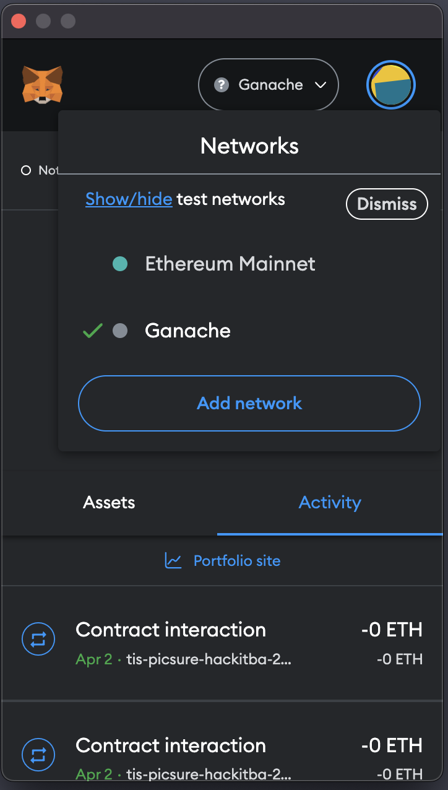
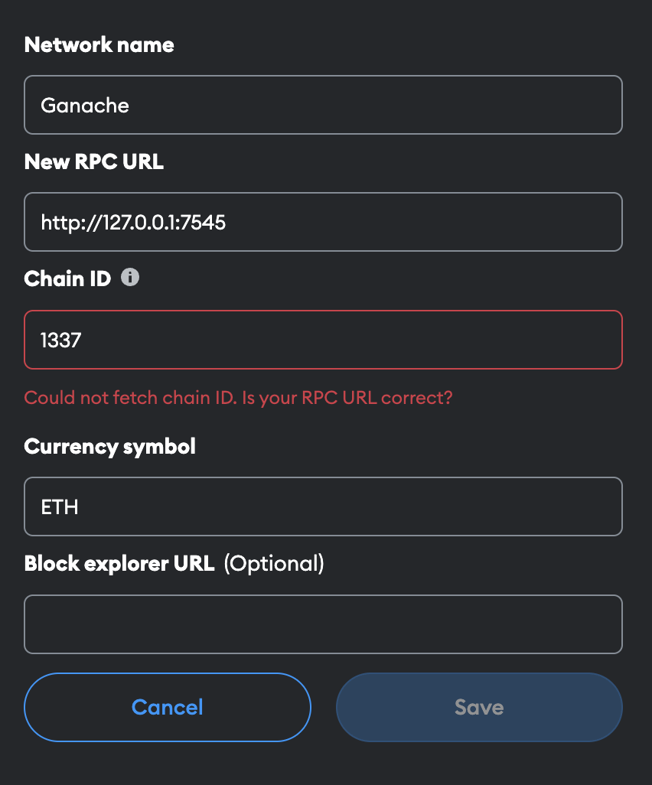

# PicSure (HackITBA 2023)

# Front end

## Instalación

Dentro de la carpeta `frontend`.

Para instalar las dependencias de este proyecto:

### `npm install`

Esto instalará los paquetes necesarios que se enumeran en el archivo `package.json`.

## Ejecución de la aplicación

Para iniciar la aplicación:

### `npm start`

Esto inicia un servidor en `http://localhost:3000`.

# Back end

## Instalación

Dentro de la carpeta `backend`.

Se requiere pip y brownie

### brownie run deploy_contract.py --network [ganache-local | goerli]

# Metamask en Chrome

Agregar la network Ganache que corre de manera local

Darle a "Add network"

Agregar la Network Ganache que corre de manera local en el puerto 7545, con la Chain ID 1337